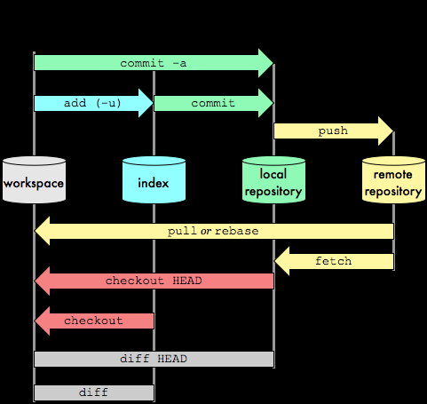
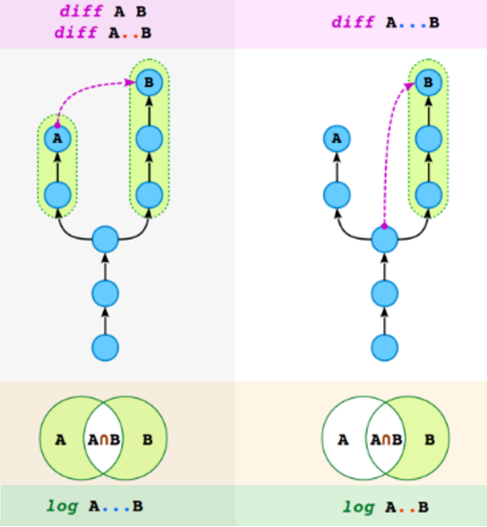

# GIT notes

GIT phases:
1. Working Area
2. Index/Staging
3. Local repository
4. Remote repository





- A ref is anything that points to a commit, like branches (heads), tags, remote branch
- HEAD is a pointer to the commit that is currently active. Only one head at a time exists! If HEAD is not a tag or a branch, it is called a DETACHED HEAD.

git reset:
1. Move current branch (or move it to same place)
2. Copy 
   1. --hard: Copy current commit to index and working area
   2. --mixed: Copy current commit to index (default)
   3. --soft: No copy


|     HEAD                      |     Head commit                                           |
|-------------------------------|-----------------------------------------------------------|
|     HEAD^                     |     Parent of head   commit                               |
|     HEAD^^      HEAD~2        |     Parent of parent   of head commit                     |
|     HEAD~2^2                  |     Second parent of   parent of parent of head commit    |
|     ORIG_HEAD     HEAD@{1)    |     Previous HEAD   commit, e.g. before the reset         |
|     HEAD@{2}                  |     Previous previous   HEAD commit                       |

## Cheatsheet


|     Merge                                                                     |      |
|--------------------------------------------------------------------------------------|-------------------------------------------------------------------------------------------------------------------------------------------------------------------|
|     Cancel merge                                                                     |     git merge   --abort                                                                                                                                           |
|     Show (non)merged   branches into HEAD                                            |     git branch            --merged           --no-merged -a                                                                                                       |
|     Undo a merge                                                                     |     git revert -m 1 <merge-commit-hash>                                                                                                                           |
|     Undo merge/rebase                                                                |     git reflog     Find commit BEFORE rebase/merge     git reset HEAD@{4}     git update-ref   refs/heads/master SHA1                                             |
|     Rewrite history   interactively                                                  |     git rebase -i                                                                                                                                                 |
|     Rebase (flatten)   the history from last 10 commits                              |     git rebase HEAD~10                                                                                                                                            |
|     Get commit to   start rebase (most-reent commonn commit)                         |     git merge-base   feature master                                                                                                                               |
|     Rebase mybranch on   top of master                                               |     git rebase master   mybranch                                                                                                                                  |
|     Merge single   commit (without parents)                                          |     git cherry-pick <ref>                                                                                                                                         |
|                                                                                      |     --strategy-option=ours     --strategy-option=theirs     From <https://stackoverflow.com/questions/173919/is-there-a-theirs-version-of-git-merge-s-ours>       |

|     Change                                                                     |      |
|--------------------------------------------------------------------------------------|-------------------------------------------------------------------------------------------------------------------------------------------------------------------|
|     Add parts of changes to index                                                  |     git add -p                                                                                                                                                    |
|     Checkout parts of changes                                                      |     git c -p                                                                                                                                                      |
|     Commit parts of changes                                                        |     git cm -p                                                                                                                                                     |
|     Stash parts of changes                                                         |     git stash -p                                                                                                                                                  |
|                                                                                      |     --include-untracked                                                                                                                                           |
|     Compare index and   repo                                                         |     git diff --cached                                                                                                                                             |
|     Checkout and   create branch                                                     |     git c -b quickfix                                                                                                                                             |
|     Compare working   area and index     (only   ts files)     (only   filenames)    |     git diff            -- *.ts           -name-only                                                                                                              |
|     Remove unstaged   files                                                          |     git c .                                                                                                                                                       |
|                                                                                      |                                                                                                                                                                   |
|     Remove untracked   files                                                         |     git clean -df                                                                                                                                                 |
|     Redo HEAD commit                                                                 |     git commit --amend                                                                                                                                            |


|     Branches                                                                         |                                                                                                                                                                   |
|--------------------------------------------------------------------------------------|-------------------------------------------------------------------------------------------------------------------------------------------------------------------|
|     Delete local tag                                                                 |     git tag -d tagname                                                                                                                                            |
|     Delete local   branch                                                            |     git branch -d <ref>                                                                                                                                           |
|     Delete remote   branch or tag                                                    |     git push origin   --delete somebranchortag                                                                                                                    |
|     Deleted locally   branches that are merged                                       |     git fetch -p                                                                                                                                                  |
|     Add tag                                                                          |     git tag <tagname> <ref?>                                                                                                                                      |
|     Set branch point   to commit                                                     |     git branch -f <branch> <ref>                                                                                                                                  |
|     On what branch is   commit?                                                      |     git branch   --contains <ref>                                                                                                                                 |
|     Show non-merged   branches                                                       |     git branch   --no-merged -a master                                                                                                                            |
|     Rename branch                                                                    |     git branch -m   oldname newname                                                                                                                               |

|     Observe                                                                          |                                                                                                                                                                   |
|--------------------------------------------------------------------------------------|-------------------------------------------------------------------------------------------------------------------------------------------------------------------|
|     Show commits not   merged to branch                                              |     git show-branch   --topic develop                                                                                                                             |
|     Show diff from   stash     detailed                                              |     git stash show -p <stash-nr>     git stash show <stash-nr>                                                                                                    |
|                                                                                      |                                                                                                                                                                   |
|     Show non-pushed   commits                                                        |     git cherry -v                                                                                                                                                 |
|                                                                                      |     git lf                                                                                                                                                        |
|     Compare branches                                                                 |     git diff master   develop                                                                                                                                     |
|                                                                                      |     git diff master   develop *myfile.ts                                                                                                                          |
|     Show old version   of file                                                       |     git show <ref>:path/file.ext                                                                                                                                  |
|     Blame a file                                                                     |     git blame <path>                                                                                                                                              |
|     List nonversioned   files          also ignored files                            |     git clean -dn \|   cut -c 14-     git clean -dnx \|   cut -c 14-                                                                                              |
|     LOG                                                                              |     git l                                                                                                                                                         |
|         commits from common point on `ref1` until endpoint `ref2`                        |          <ref1>..<ref2>                                                                                                                                           |
|         commits from `ref1` to common point until `ref2`                                 |          <ref1>...<ref2>                                                                                                                                          |
|         only current directory                                                       |        .                                                                                                                                                          |
|         merge commits                                                                |         --merges                                                                                                                                                  |
|         changes to specific file                                                     |         -- "*file.js"                                                                                                                                             |
|         author                                                                       |         --author "Wouter"                                                                                                                                         |
|         message                                                                      |         --grep=mymessage                                                                                                                                          |
|         all branches                                                                 |         --all                                                                                                                                                     |
|         only folder/file names                                                       |         --name-only                                                                                                                                               |

|     Synchronize                                                                      |                                                                                                                                                                   |
|--------------------------------------------------------------------------------------|-------------------------------------------------------------------------------------------------------------------------------------------------------------------|
|     Set remote                                                                       |     git remote set-url   https://......                                                                                                                           |
|     Show remote                                                                      |     git remote -v                                                                                                                                                 |
|     Show remote   branches                                                           |     git ls-remote                                                                                                                                                 |
|     Pull/push specific   branch                                                      |     git pull   origin develop     git push   origin develop                                                                                                       |
|     Set upstream   branch                                                            |     git push -u origin   branch                                                                                                                                   |
|     Push all   branches/tags                                                         |     git push --all   origin                                                                                                                                       |
|     Update/fast   forward remote branch      WITHOUT TOUCHING   LOCAL                |     git fetch origin   develop:develop                                                                                                                            |
|     Pull without merge   commit (reapplies your own commits)                         |     git pull --rebase                                                                                                                                             |

|     Statistics                                                                       |                                                                                                                                                                   |
|--------------------------------------------------------------------------------------|-------------------------------------------------------------------------------------------------------------------------------------------------------------------|
|     Commits per author                                                               |     git shortlog                                                                                                                                                  |
|     sum                                                                              |     -s                                                                                                                                                            |
|     git show-ref                                                                     |     All refs                                                                                                                                                      |
|         develop                                                                      |     Both local and   remote ref                                                                                                                                   |


Vim delete all lines (cancel a merge):
- gg
- dG

Git config (voor aliases etc):
%USERPROFILE%\.gitconfig
Is stored at H:\


Git Database
The Git database contains a tree of commits. Each commit refers to - besides the root commit, one or two parent commits - a node in the tree.

```
git cat-file HEAD -p
tree 276d6c5ba3b7a4c95c95248c7fb5f7be591c5d50
parent 07914fae48ffb3305df04753860ef0c738751164
author Wouter van Koppen <wvkoppen@gmail.com> 1561616186 +0200
committer Wouter van Koppen <wvkoppen@gmail.com> 1561616186 +0200
```

These tree nodes can contain files (blobs) and directories(trees).

```
git cat-file 276d6c5ba3b7a4c95c95248c7fb5f7be591c5d50 -p
100644 blob 2d6b54b5349a7c6d27f4579d4c2db7ada4043022    1.j
040000 tree c3fe1f0484edb75ca3c4c5e49ba19d820c84c179    folder
100644 blob 3627f0b31c889a585ac7ad59d39194233988e90a    props
```

Thus each commit in Git stores a complete representation of the file structure, the hashes make sure that files that are not changed files are not stored redundantly.


### Git aliases
```

[alias]
	## Prune branches: 
	pb = !git remote prune origin && git branch -vv | grep ': gone]' | awk '{print $1}' | xargs -r git branch -d	 
	pbnor = !git c master && git branch --merged | grep -v "master" >/tmp/merged-branches && vi /tmp/merged-branches && xargs git branch -d </tmp/merged-branches
	
	## Show object/commit
	so = show --pretty='* %C(yellow)%h%C(red) parent:%C(yellow)%p%C(cyan)%d%Creset: %w(72,2,2)%s%n%w(72,0,0)%C(cyan)%an%Creset %Cgreen%ar%Creset %C(yellow) %ad %Creset' --date=format:'%Y-%m-%d %H:%M:%S'
	sc = show --pretty='* %C(yellow)%h%C(red) parent:%C(yellow)%p%C(cyan)%d%Creset: %w(72,2,2)%s'  --quiet
	
	## Colorful log
	l = log --pretty='%C(yellow)%h%Creset%Cgreen %cr %Creset%C(red) %ad %Creset%C(cyan)%an%Creset%C(green)%d%Creset%<|(120,trunc) %s' --graph --date=format:'%Y-%m-%d %H:%M:%S'
	
	## General
	d = diff --word-diff 
	dc = !git d --cached
	s = status 
	q = stash
	c = checkout
	cm  = commit
	p  = push
	f  = fetch
	b = branch
	ba = branch -a

  # Diff/log from checked out commit to fetched commit
	df = !git d HEAD..FETCH_HEAD
	lf = !git l HEAD...FETCH_HEAD
	
	sr = show-ref
	refs = for-each-ref
	r = rebase
  
	#Safe wipe: Add every file/change, commit to a dummy commit and rewind back to the initial commit. 
	sawi = !git add . && git commit -qm 'WIPE SAVEPOINT' && git reset --hard HEAD~1

	
[push]
	default = current
[core]
	autocrlf = true


```
